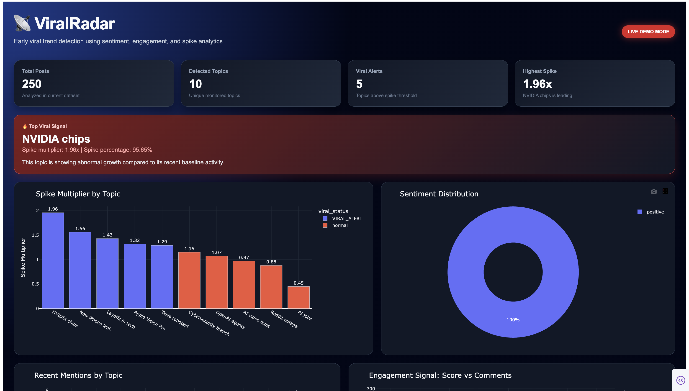
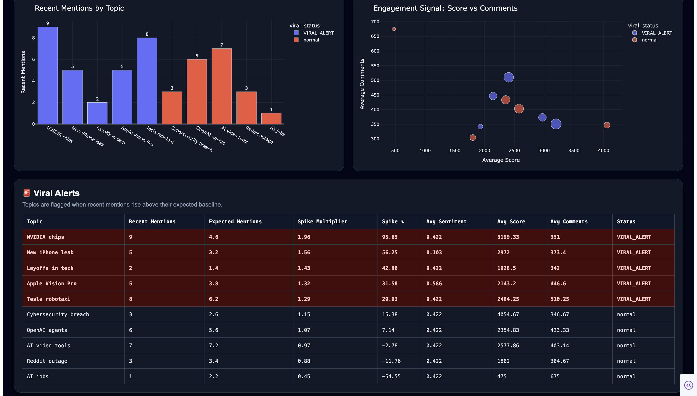

# 📡 ViralRadar

**ViralRadar** is a viral trend detection dashboard that identifies fast-rising social media topics before they gain massive attention.

It works like a **weather radar for the internet**. Instead of detecting storms, ViralRadar detects emerging online conversations, sentiment shifts, engagement spikes, and early viral signals from Reddit-style social media data.

---

## 🚀 Project Overview

Social media trends often begin as small conversations before becoming viral moments. By the time a topic reaches mainstream attention, brands, creators, analysts, and media teams may already be late to respond.

ViralRadar helps solve this problem by analyzing topic activity, sentiment, engagement, and spike behavior to detect early signs of virality.

The current MVP runs locally using generated Reddit-style data. This allows the complete pipeline to work without requiring live Reddit API access. The project is also structured for future upgrades such as Reddit API integration, Kafka streaming, Slack alerts, and cloud deployment.

---

## 🎯 Problem Statement

Online trends move quickly. A topic can start gaining traction on Reddit or social media hours before it becomes a headline or viral discussion.

The challenge is to detect those early signals before the topic fully explodes.

ViralRadar identifies these signals by comparing recent topic activity against baseline activity and flagging abnormal growth as a potential viral alert.

---

## 💡 Key Idea

If a topic appears much more frequently in a recent time window compared to its previous baseline activity, ViralRadar marks it as a possible viral moment.

Example:

    Topic: OpenAI agents
    Recent mentions: 30
    Expected mentions: 8
    Spike multiplier: 3.75x
    Status: VIRAL_ALERT

---

## ✨ Features

- Generates Reddit-style social media post data
- Processes post titles, topics, subreddit names, scores, comments, upvote ratios, timestamps, and URLs
- Performs NLP-based sentiment analysis using Hugging Face Transformers with VADER fallback
- Classifies each post as positive, neutral, or negative
- Detects abnormal topic spikes using sliding-window analytics
- Compares recent topic activity with baseline activity
- Calculates spike multiplier and spike percentage
- Flags fast-rising topics as `VIRAL_ALERT`
- Tracks average score, comments, and sentiment for each topic
- Visualizes viral signals through an interactive Plotly Dash dashboard
- Displays KPI cards for total topics, viral alerts, top topic, and highest spike
- Includes charts for spike multiplier, recent mentions, sentiment distribution, and engagement
- Includes a viral alerts table with topic-level metrics
- Includes Reddit API-ready structure for future live data collection
- Generates Slack-style viral alert messages for detected trending topics
- Includes future-ready structure for Kafka streaming, real Slack webhooks, and deployment

---

## 🧠 How It Works

ViralRadar follows a simple analytics pipeline:

    Generate Reddit-Style Posts
            ↓
    Analyze Sentiment
            ↓
    Detect Topic Spikes
            ↓
    Create Viral Alerts
            ↓
    Display Interactive Dashboard

The project first creates sample Reddit-style posts. Each post includes a title, topic, subreddit, score, comments, upvote ratio, timestamp, and URL.

Then the sentiment analyzer reads each post title and assigns a sentiment score and sentiment label.

After that, the spike detector compares recent topic mentions against previous baseline mentions. If the recent activity is higher than expected, the topic is flagged as a viral alert.

Finally, the dashboard visualizes the results using KPI cards, bar charts, pie charts, scatter plots, and a detailed alerts table.

---

## 🏗️ System Architecture

    Data Generator / Reddit Collector
            ↓
    Raw Reddit-Style Posts
            ↓
    Sentiment Analyzer
            ↓
    Enriched Posts Dataset
            ↓
    Spike Detector
            ↓
    Viral Alerts Dataset
            ↓
    Plotly Dash Dashboard

---

## 📊 Dashboard Preview

---

## 📌 Dashboard Insights

The dashboard shows:

- Total number of detected topics
- Number of viral alerts
- Top trending topic
- Highest spike multiplier
- Spike multiplier by topic
- Recent mentions by topic
- Sentiment distribution
- Engagement comparison using score and comments
- Viral alerts table with topic-level metrics

---

## 🛠️ Current Tech Stack

- **Python** — Core programming language
- **Pandas** — Data processing and analysis
- **NumPy** — Numerical operations
- **Hugging Face Transformers** — Transformer-based sentiment analysis
- **VADER Sentiment** — Fallback lightweight NLP sentiment analysis
- **Plotly** — Interactive visualizations
- **Dash** — Dashboard web application framework
- **python-dotenv** — Environment variable management
- **Slack-style Alert Simulation** — Generates alert messages for viral topics

---

## 🔮 Planned Enhancements

- **Reddit API using PRAW** — Collect live Reddit posts
- **Apache Kafka** — Stream posts in real time
- **Slack Webhooks** — Send alerts when viral spikes are detected
- **PostgreSQL** — Store historical trend and alert data
- **Docker** — Containerize the application
- **AWS / Render Deployment** — Deploy the dashboard online
- **Machine Learning Model** — Predict virality probability using engagement and trend features

---

## 📁 Project Structure

    ViralRadar/
    │
    ├── dashboard/
    │   ├── __init__.py
    │   └── app.py
    │
    ├── data/
    │   ├── raw/
    │   │   ├── .gitkeep
    │   │   └── reddit_posts.csv
    │   │
    │   └── processed/
    │       ├── .gitkeep
    │       ├── enriched_posts.csv
    │       └── viral_alerts.csv
    │
    ├── scripts/
    │   ├── generate_sample_posts.py
    │   └── run_pipeline.py
    │
    ├── tests/
    │
    ├── viralradar/
    │   ├── __init__.py
    │   │
    │   ├── producers/
    │   │   ├── __init__.py
    │   │   └── reddit_collector.py
    │   │
    │   ├── consumers/
    │   │   ├── __init__.py
    │   │   └── sentiment_analyzer.py
    │   │
    │   ├── detectors/
    │   │   ├── __init__.py
    │   │   └── spike_detector.py
    │   │
    │   └── utils/
    │       ├── __init__.py
    │       └── config.py
    │
    ├── screenshots/
    │   └── dashboard_preview.png
    │
    ├── .env.example
    ├── .gitignore
    ├── requirements.txt
    └── README.md

---

## ⚙️ Installation

Clone the repository:

    git clone https://github.com/your-username/ViralRadar.git
    cd ViralRadar

Create a virtual environment:

    python3 -m venv venv

Activate the virtual environment:

    source venv/bin/activate

Install dependencies:

    pip install -r requirements.txt

---

## ▶️ Run the Project

Run the complete pipeline:

    python scripts/run_pipeline.py

This command runs:

    1. Sample Reddit-style data generation
    2. Sentiment analysis
    3. Viral spike detection

Start the dashboard:

    python -m dashboard.app

Open the dashboard in your browser:

    http://127.0.0.1:8060/

---

## 📂 Output Files

After running the pipeline, the following files are created:

    data/raw/reddit_posts.csv
    data/processed/enriched_posts.csv
    data/processed/viral_alerts.csv
    data/processed/slack_alerts.txt

---

## 📈 Spike Detection Logic

ViralRadar compares recent mentions of a topic against its previous baseline activity.

    Spike Multiplier = Recent Mentions / Expected Mentions

If the spike multiplier crosses the threshold, the topic is marked as:

    VIRAL_ALERT

For the current MVP, the threshold is set lower for demo purposes so viral alert behavior is visible in the dashboard.

---

## 🧪 Sentiment Analysis

ViralRadar uses Hugging Face Transformers for sentiment analysis, with VADER as a fallback option. Post titles are classified as:

    positive
    neutral
    negative

Each post receives:

- Sentiment score
- Sentiment label
- Topic
- Subreddit
- Score
- Number of comments
- Upvote ratio
- Timestamp

---

## 🚨 Example Viral Alert

    Topic: Layoffs in tech
    Recent Mentions: 3
    Expected Mentions: 1.6
    Spike Multiplier: 1.88x
    Spike Percentage: 87.5%
    Status: VIRAL_ALERT

---

## 🌐 Reddit API Support

The project includes a Reddit collector module using PRAW.

The current MVP uses generated Reddit-style data because live Reddit developer access may be unavailable on some networks. Live Reddit API support can be enabled later by adding valid Reddit API credentials.

Create a `.env` file using this format:

    REDDIT_CLIENT_ID=your_client_id
    REDDIT_CLIENT_SECRET=your_client_secret
    REDDIT_USER_AGENT=python:ViralRadar:v1.0 by u_yourredditusername
    SUBREDDITS=technology,artificial,MachineLearning,worldnews

Important: the real `.env` file should never be committed to GitHub.

---

## 🔐 Environment Variables

The `.env.example` file shows the required variables:

    REDDIT_CLIENT_ID=
    REDDIT_CLIENT_SECRET=
    REDDIT_USER_AGENT=python:ViralRadar:v1.0 by u_yourredditusername
    SUBREDDITS=technology,artificial,MachineLearning,worldnews

The `.gitignore` file excludes `.env` to protect private credentials.

---

## 🚀 Future Roadmap

- Connect live Reddit API data
- Add Apache Kafka for real-time streaming
- Add Slack alerts for viral spikes
- Store historical data in PostgreSQL
- Add Docker Compose setup
- Deploy dashboard to AWS or Render
- Add machine learning model for virality prediction
- Add automated refresh and scheduled trend monitoring

---

## ⭐ Project Status

Current version: **MVP Complete**

Completed:

- Reddit-style sample data generation
- Sentiment analysis
- Viral spike detection
- Dashboard visualization
- GitHub-ready project structure
- README documentation

Planned:

- Live Reddit API integration
- Kafka streaming
- Slack alerting
- Cloud deployment

---
## 🧑‍💻 Author

**Shreya Karamchedu**
